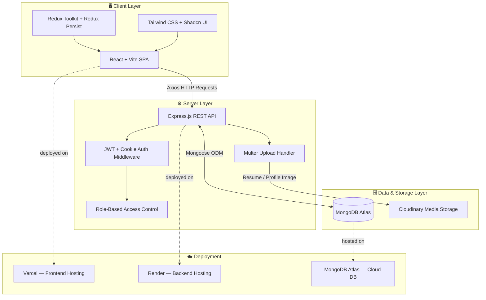
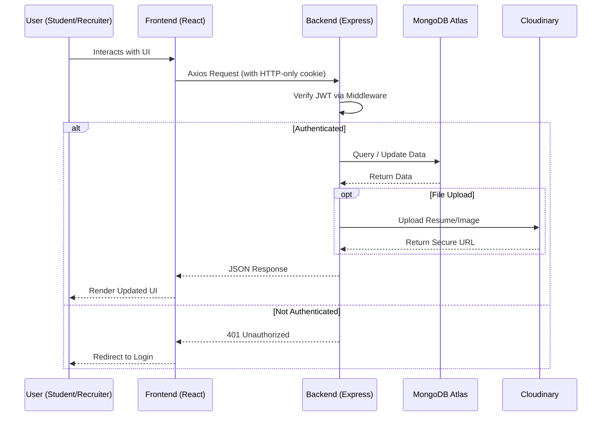
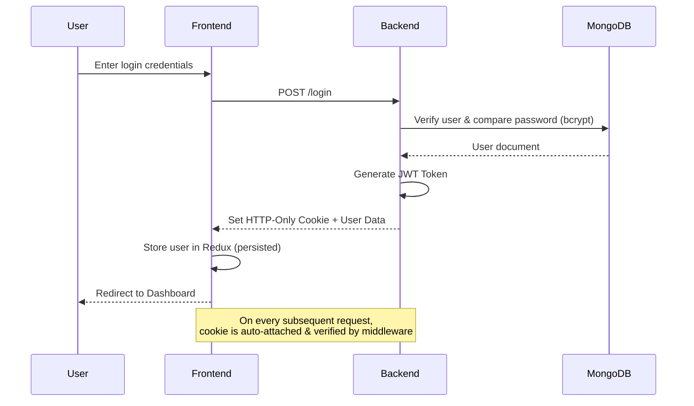

<div align="center">

# 💼 Job Portal — Full Stack MERN Application

### A modern, production-ready Job Portal connecting Students with Recruiters.

<p>
  
  
  
  
</p>

<p>
  
  
  
  
</p>

<p>
  
  
  
  
  
</p>

<br />


</div>

<br />

## 📖 Table of Contents

- [🌟 Overview](#-overview)
- [✨ Key Features](#-key-features)
- [🛠️ Tech Stack](#️-tech-stack)
- [🏗️ Architecture Overview](#️-architecture-overview)
- [📂 Folder Structure](#-folder-structure)
- [⚙️ Installation Guide](#️-installation-guide)
- [🔑 Environment Variables](#-environment-variables)
- [🖥️ Backend Setup](#️-backend-setup)
- [💻 Frontend Setup](#-frontend-setup)
- [🚀 Deployment Instructions](#-deployment-instructions)
- [📡 API Endpoints](#-api-endpoints)
- [🔐 Authentication Flow](#-authentication-flow)
- [🖼️ Screenshots](#️-screenshots)
- [🧭 Future Improvements](#-future-improvements)
- [🛡️ Security Features](#️-security-features)
- [⚡ Performance Features](#-performance-features)
- [🤝 Contribution Guide](#-contribution-guide)
- [📄 License](#-license)
- [👨‍💻 Author](#-author)
- [📬 Contact](#-contact)

<br />

## 🌟 Overview

**Job Portal** is a complete **Full Stack MERN application** designed to bridge the gap between **Job Seekers (Students)** and **Recruiters**.

- 🎓 **Students** can search, browse, and apply for jobs, track their applications, and manage their profile with resume & profile picture uploads.
- 🏢 **Recruiters** can register their companies, post job openings, view applicants, and shortlist or reject candidates — all from an intuitive dashboard.

Built with scalability, security, and performance in mind, this project follows industry-standard practices including **JWT + Cookie-based authentication**, **role-based access control**, **Cloudinary media storage**, and a **fully responsive UI** powered by **Tailwind CSS** and **Shadcn UI**.

> 💡 This project is ideal for demonstrating real-world full-stack development skills — authentication, file uploads, REST APIs, state management, and cloud deployment.

<br />

## ✨ Key Features

<table>
<tr>
<td width="50%" valign="top">

### 🎓 Student Module
- ✔ Signup / Login
- ✔ Search & Browse Jobs
- ✔ Apply to Jobs
- ✔ View Applied Jobs Status
- ✔ Update Profile
- ✔ Upload Resume
- ✔ Upload Profile Picture

</td>
<td width="50%" valign="top">

### 🏢 Recruiter Module
- ✔ Login
- ✔ Register Company
- ✔ Update Company Details
- ✔ Create Job Postings
- ✔ View Posted Jobs
- ✔ View Applicants
- ✔ Accept / Reject Applicants

</td>
</tr>
</table>

### 🌐 Platform-Wide Features

| Feature | Description |
|---|---|
| 🔐 JWT Authentication | Secure token-based auth |
| 🍪 Cookie-Based Login | HTTP-only cookie sessions |
| 🛡️ Role-Based Access | Separate flows for Student & Recruiter |
| 📄 Resume Upload | Cloudinary-powered file storage |
| 🖼️ Profile Picture Upload | Cloud-hosted image management |
| 🏢 Company Management | Full CRUD for company profiles |
| 📢 Job Posting | Recruiters can create & manage listings |
| 📊 Applicant Tracking | Track & manage candidate pipeline |
| 📱 Responsive UI | Mobile-first, fully responsive design |
| 💾 Redux Persist | Persistent client-side state |
| 🔒 Protected Routes | Frontend + backend route guarding |
| 🔗 REST APIs | Clean, modular API architecture |

<br />

## 🛠️ Tech Stack

<div align="center">

### Frontend


### Backend


### Database, Auth & Deployment


</div>

<br />

## 🏗️ Architecture Overview



<details>
<summary><b>🔎 Click to view Request Flow (Sequence Diagram)</b></summary>



</details>

<br />

## 📂 Folder Structure

```bash
job-portal/
│
├── backend/
│   ├── controllers/         # Route logic (auth, job, application, company)
│   ├── middlewares/         # JWT verification, role guards, multer config
│   ├── models/               # Mongoose schemas (User, Job, Company, Application)
│   ├── routes/                # Express route definitions
│   ├── utils/                  # Helper functions, DB connection, cloudinary config
│   ├── .env                    # Environment variables (not committed)
│   ├── server.js              # App entry point
│   └── package.json
│
├── frontend/
│   ├── src/
│   │   ├── components/       # Reusable UI components (Shadcn-based)
│   │   ├── hooks/               # Custom React hooks
│   │   ├── pages/               # Page-level views (Home, Jobs, Profile, Dashboard)
│   │   ├── redux/               # Redux Toolkit slices & store config
│   │   ├── utils/                 # Axios instance, constants, helpers
│   │   ├── App.jsx
│   │   └── main.jsx
│   ├── index.html
│   ├── vite.config.js
│   └── package.json
│
├── .gitignore
├── LICENSE
└── README.md
```

<br />

## ⚙️ Installation Guide

### ✅ Prerequisites

Make sure you have the following installed:

- [Node.js](https://nodejs.org/) (v18+)
- [MongoDB Atlas](https://www.mongodb.com/atlas) account
- [Cloudinary](https://cloudinary.com/) account
- [Git](https://git-scm.com/)

### 📥 Clone the Repository

```bash
git clone https://github.com/yourusername/job-portal.git
cd job-portal
```

<br />

## 🔑 Environment Variables

Create a `.env` file inside the **`backend/`** directory with the following keys:

```env
# Server
PORT=8000
NODE_ENV=development

# MongoDB
MONGO_URI=your_mongodb_atlas_connection_string

# JWT
JWT_SECRET_KEY=your_jwt_secret_key
JWT_EXPIRES_IN=1d

# Cloudinary
CLOUD_NAME=your_cloudinary_cloud_name
API_KEY=your_cloudinary_api_key
API_SECRET=your_cloudinary_api_secret

# CORS
CLIENT_URL=http://localhost:5173
```

Create a `.env` file inside the **`frontend/`** directory:

```env
VITE_API_BASE_URL=http://localhost:8000/api/v1
```

> ⚠️ **Never commit your `.env` files.** They are already listed in `.gitignore`.

<br />

## 🖥️ Backend Setup

<details>
<summary><b>Click to expand backend setup steps</b></summary>

```bash
# 1. Move into backend directory
cd backend

# 2. Install dependencies
npm install

# 3. Run in development mode (with nodemon)
npm run dev

# 4. Run in production mode
npm start
```

The backend server will start on:
```
http://localhost:8000
```

</details>

<br />

## 💻 Frontend Setup

<details>
<summary><b>Click to expand frontend setup steps</b></summary>

```bash
# 1. Move into frontend directory
cd frontend

# 2. Install dependencies
npm install

# 3. Run development server
npm run dev

# 4. Build for production
npm run build

# 5. Preview production build
npm run preview
```

The frontend will start on:
```
http://localhost:5173
```

</details>

<br />

## 🚀 Deployment Instructions

### 🔹 Backend → Render

<details>
<summary><b>Click to expand Render deployment steps</b></summary>

1. Push your backend code to a GitHub repository.
2. Go to [Render](https://render.com/) → **New → Web Service**.
3. Connect your GitHub repo and select the `backend` folder as root.
4. Set the following:
   - **Build Command:** `npm install`
   - **Start Command:** `npm start`
5. Add all backend environment variables under **Environment → Environment Variables**.
6. Deploy 🚀 — Render will generate a live backend URL.

</details>

### 🔹 Frontend → Vercel

<details>
<summary><b>Click to expand Vercel deployment steps</b></summary>

1. Push your frontend code to GitHub.
2. Go to [Vercel](https://vercel.com/) → **New Project**.
3. Import your repository and set root directory to `frontend`.
4. Set **Build Command:** `npm run build` and **Output Directory:** `dist`.
5. Add environment variable:
   ```
   VITE_API_BASE_URL=https://your-render-backend-url/api/v1
   ```
6. Deploy 🚀 — Vercel will generate a live frontend URL.

</details>

### 🔹 Database → MongoDB Atlas

1. Create a free cluster on [MongoDB Atlas](https://www.mongodb.com/atlas).
2. Whitelist IP `0.0.0.0/0` (or Render's IP) under **Network Access**.
3. Create a database user and copy the connection string into `MONGO_URI`.

<br />

## 📡 API Endpoints

### 🔐 Auth Routes — `/api/v1/user`

| Method | Endpoint | Description | Access |
|--------|----------|-------------|--------|
| POST | `/register` | Register a new user (Student/Recruiter) | Public |
| POST | `/login` | Login user & set JWT cookie | Public |
| GET | `/logout` | Logout user & clear cookie | Private |
| POST | `/profile/update` | Update profile, resume, profile picture | Private |

### 💼 Job Routes — `/api/v1/job`

| Method | Endpoint | Description | Access |
|--------|----------|-------------|--------|
| POST | `/post` | Create a new job listing | Recruiter |
| GET | `/get` | Get all jobs (with search/filter) | Public |
| GET | `/get/:id` | Get single job details | Public |
| GET | `/getadminjobs` | Get jobs posted by logged-in recruiter | Recruiter |

### 🏢 Company Routes — `/api/v1/company`

| Method | Endpoint | Description | Access |
|--------|----------|-------------|--------|
| POST | `/register` | Register a new company | Recruiter |
| GET | `/get` | Get all companies of recruiter | Recruiter |
| GET | `/get/:id` | Get single company details | Recruiter |
| PUT | `/update/:id` | Update company details | Recruiter |

### 📄 Application Routes — `/api/v1/application`

| Method | Endpoint | Description | Access |
|--------|----------|-------------|--------|
| GET | `/apply/:id` | Apply to a job | Student |
| GET | `/get` | Get applied jobs of logged-in student | Student |
| GET | `/:id/applicants` | Get all applicants for a job | Recruiter |
| POST | `/status/:id/update` | Accept/Reject an applicant | Recruiter |

<br />

## 🔐 Authentication Flow



**Highlights:**
- 🔑 Passwords hashed using **bcryptjs** before storage.
- 🍪 JWT stored in **HTTP-Only, Secure cookies** — not accessible via JS (XSS-safe).
- 🛡️ Middleware validates token on every protected route.
- 👥 Role field (`student` / `recruiter`) determines access to role-specific routes.

<br />

## 🖼️ Screenshots

<div align="center">

| Home Page | 
|:---:|
|  |

| Student Login | 
|:---:|
|  | 

| Student Registration |
|:---:|
|  | 

</div>

<br />

## 🧭 Future Improvements

- [ ] 📧 Email notifications on application status change
- [ ] 💬 Real-time chat between recruiter and applicant
- [ ] 🔍 Advanced filters (salary range, experience, remote/on-site)
- [ ] ⭐ Save/Bookmark jobs feature
- [ ] 📊 Recruiter analytics dashboard (charts, insights)
- [ ] 🌐 Multi-language support (i18n)
- [ ] 🧪 Unit & integration testing (Jest + React Testing Library)
- [ ] 🔔 Push notifications
- [ ] 🧠 AI-based resume-job matching

<br />

## 🛡️ Security Features

| Feature | Implementation |
|---|---|
| 🔐 Password Hashing | `bcryptjs` with salted hashes |
| 🍪 Secure Auth | JWT stored in **HTTP-Only** cookies |
| 🛡️ Route Protection | Middleware-based auth guards |
| 👥 Role-Based Access | Student vs Recruiter route separation |
| 🌐 CORS Policy | Configured allowed origins only |
| 🧼 Input Validation | Server-side validation on all endpoints |
| 📁 Safe File Uploads | Multer + Cloudinary (type/size restrictions) |

<br />

## ⚡ Performance Features

- ⚙️ **Vite** for lightning-fast frontend builds & HMR.
- 💾 **Redux Persist** to avoid redundant API calls on refresh.
- 🗜️ **Cloudinary** auto image optimization & CDN delivery.
- 🧵 **Mongoose Indexing** on frequently queried fields.
- 📦 **Lazy Loading** of React components/routes.
- 🚀 **Axios instance** with centralized base URL & interceptors.

<br />

## 🤝 Contribution Guide

Contributions are what make the open-source community amazing! 🎉

<details>
<summary><b>Click to view contribution steps</b></summary>

1. **Fork** the repository.
2. **Clone** your fork:
   ```bash
   git clone https://github.com/your-username/job-portal.git
   ```
3. **Create a new branch:**
   ```bash
   git checkout -b feature/your-feature-name
   ```
4. **Commit your changes:**
   ```bash
   git commit -m "feat: add your feature description"
   ```
5. **Push to your branch:**
   ```bash
   git push origin feature/your-feature-name
   ```
6. Open a **Pull Request** and describe your changes clearly.

**Guidelines:**
- Follow existing code style & folder structure.
- Write meaningful commit messages.
- Test your changes before submitting a PR.

</details>

<br />

## 📄 License

This project is licensed under the **MIT License** — see the [LICENSE](./LICENSE) file for details.

<br />

## 👨‍💻 Author

<div align="center">

**Your Name**

[](https://github.com/rajlaxmi12)
[](https://www.linkedin.com/in/raj-laxmi-4007a7332/)
[](https://portfolio-rl.vercel.app/)

</div>

<br />

## 📬 Contact

For queries, suggestions, or collaboration opportunities:

📧 **Email:** raj.laxmi.1236@gmail.com
🐛 **Report a Bug:** [Open an Issue](https://github.com/rajlaxmi12/job-portal/issues)
💡 **Feature Request:** [Open a Discussion](https://github.com/rajlaxmi12/job-portal/discussions)

<br />

<div align="center">

### ⭐ If you found this project helpful, consider giving it a star!

**Made with ❤️ using the MERN Stack**

</div>
